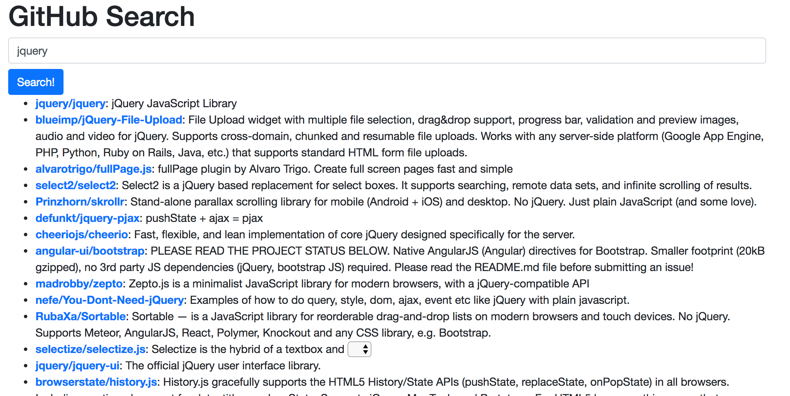

# Ajax Activity

In this activity, you'll practice working with `fetch()` and `Promises` in JavaScript (make sure you're read the [book chapters](https://info343.github.io/ajax.html)). You will make a simple search tool to query the [GitHub API](https://developer.github.com/v3/), and return relevant repositories:

