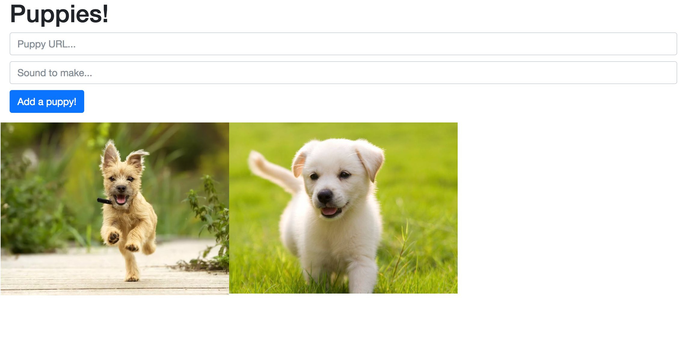

# ES-6 Activity

In this activity, you'll practice working with ES6 features, namely **arrow functions** and **Classes**. Make sure you're familiar with the corresponding [book chapters](https://info343.github.io/es6.html). You'll use these skills to build this (interactive!) webpage:

